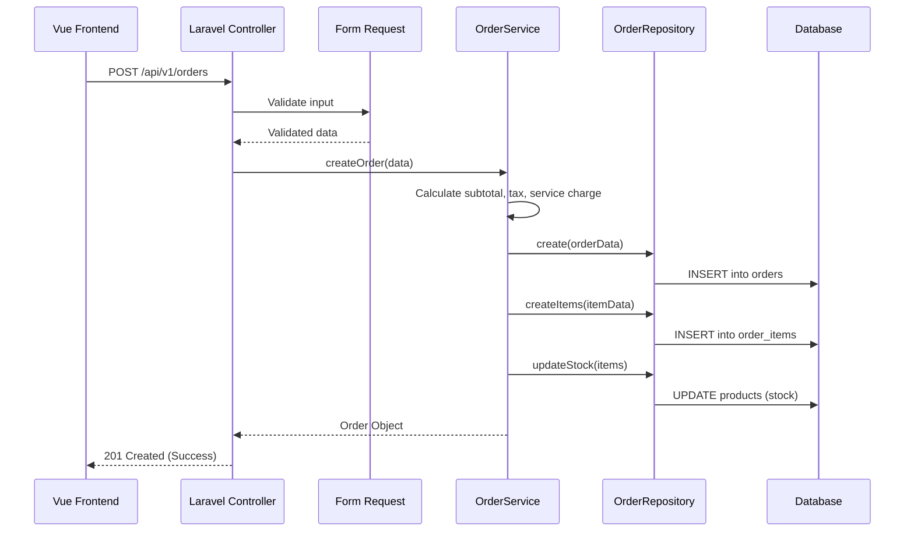
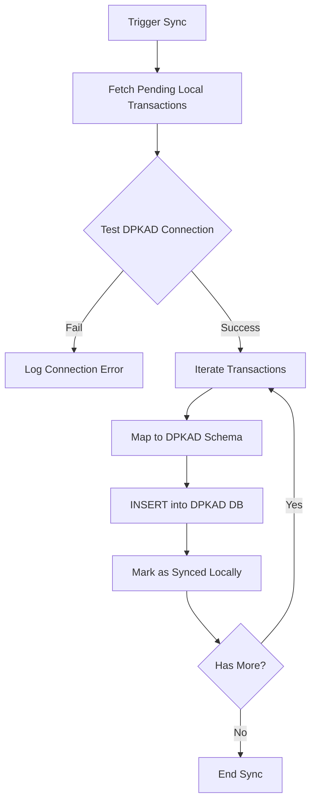

# System Workflows

This document outlines the core workflows and data processing pipelines within Restoku.

## 1. Transaction & Order Processing

When a cashier processes a transaction in the POS:

## 2. DPKAD External Sync

Synchronization with the Regional Financial and Asset Management Office (DPKAD) database:

## 3. Reporting & Exporting

How PDF and Excel reports are generated:

- **PDF**: Uses `DomPDF` with custom Blade templates (`resources/views/exports/reports/`).
- **Excel**: Uses `PhpSpreadsheet` via `ReportExportService`.

| Workflow | Service | Template/Format |
|----------|---------|-----------------|
| Sales Summary | `ReportExportService` | `summary.pdf` |
| Tax Report | `ReportExportService` | `tax_report.xlsx` |
| Shift Recap | `ShiftService` | `shift_report.pdf` |

## 4. Multi-Tenant Onboarding

The process of registering a new business (Tenant):

1. **User Registration**: `AuthController` receives request.
2. **Atomic Transaction**: `AuthService` wraps everything in a `DB::transaction()`.
3. **Tenant Creation**: `AuthRepository` creates a `Tenant` record.
4. **User Creation**: `AuthRepository` creates a `User` linked to the `Tenant`.
5. **Role Assignment**: User is assigned the `Admin` role via Spatie Permissions.
6. **Initialization**: (Optional) Default categories or settings are seeded.
