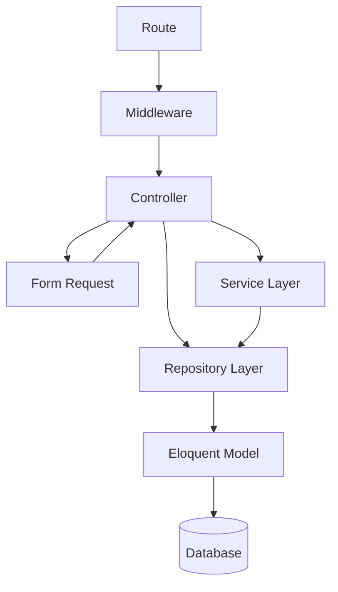

# Architecture & Design Patterns

Restoku follows a multi-layered architecture based on the **Repository Pattern** and **Service Pattern** to ensure a clean separation of concerns, testability, and maintainability.

## 1. Layered Architecture

The application flow follows this hierarchy:



### Core Layers

| Layer | Responsibility | Location |
|-------|----------------|----------|
| **Controller** | Orchestrates the request/response flow. Handles authentication and authorization. | `app/Http/Controllers/Api` |
| **Form Request** | Handles input validation and authorization logic. | `app/Http/Requests/Api` |
| **Service** | Contains complex business logic, third-party integrations, or orchestration of multiple repositories. | `app/Services` |
| **Repository** | Handles data access and Eloquent queries. Scopes data by `tenant_id`. | `app/Repositories` |
| **Interface** | Defines the contract for repositories to enable Dependency Injection. | `app/Interfaces` |
| **API Resource** | Transforms Eloquent models into JSON responses. | `app/Http/Resources/Api` |

---

## 2. Design Patterns

### Repository Pattern
Controllers depend on interfaces, not implementations. This allows for easy swapping of data sources or mocking in tests.

**Registration:**
All bindings are registered in `app/Providers/RepositoryServiceProvider.php`.

```php
public function register(): void
{
    $this->app->bind(ProductRepositoryInterface::class, ProductRepository::class);
    // ...
}
```

### Service Pattern
Used for complex operations that exceed simple CRUD:
- **`AuthService`**: Handles registration (Tenant + User + Role) within database transactions.
- **`ReportExportService`**: Manages PDF/Excel generation (DomPDF/PhpSpreadsheet).
- **`DpkadSyncService`**: Handles external database synchronization.

---

## 3. Standardized Error Handling

Restoku uses a **Centralized Exception Handler** in `bootstrap/app.php`. Controllers should generally **not** use `try-catch` blocks for common exceptions.

| Exception | Handled Response |
|-----------|------------------|
| `ValidationException` | 422 Unprocessable Entity |
| `AuthenticationException` | 401 Unauthenticated |
| `AccessDeniedHttpException` | 403 Forbidden |
| `NotFoundHttpException` | 404 Not Found |
| `Throwable` | 500 Internal Server Error (or specific code) |

**Consistent Response Format:**
```json
{
    "status": "error",
    "message": "Error message here",
    "errors": []
}
```

---

## 4. Coding Conventions

1. **Validation**: Always use Form Requests. Never use `$request->validate()` inline in Controllers.
2. **Tenant Isolation**: All queries must be scoped by `tenant_id`. Use `authorizeTenant($model)` in Controllers to verify ownership.
3. **Transactions**: Use `DB::transaction()` in Services for operations affecting multiple tables (e.g., creating a Tenant and its first User).
4. **Base Controller**: All API controllers must extend `BaseApiController` to inherit `ApiResponse` traits and utility methods.
5. **Constructors**: Use PHP 8.x constructor property promotion for Dependency Injection.

```php
public function __construct(
    protected ProductRepositoryInterface $productRepository
) {}
```

---

## 5. Module Status

| Module | Pattern | Status |
|--------|---------|--------|
| Auth | Service + Repo | ✅ Completed |
| Products | Repository | ✅ Completed |
| Reports | Service + Repo | ✅ Completed |
| Finance | Repository | ✅ Completed |
| DPKAD Sync | Service | ✅ Completed |
| Inventory | Repository | ✅ Completed |

